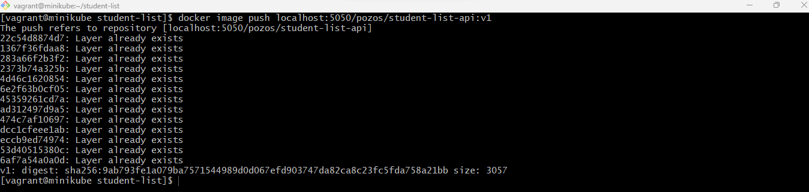
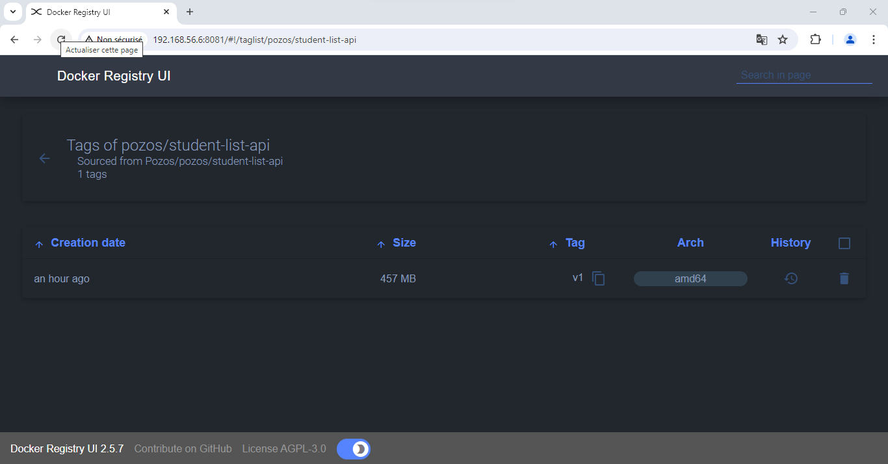

Prénom: Abdoul Gadirou

Nom: DIALLO

Promotion: BootCamp DevOps 17

# Mini-Projet Docker

Mini projet réalisé dans le cadre du Bootcamp Devops chez Easytraining.fr

# Application: Student-list

**Student-list** est une simple application de l’entreprise POZOS construite avec deux modules :

- Le premier module est une _API REST_ écrit en _Flask_ qui renvoie un fichier _JSON_ contenant la
    liste des étudiants et leur âges
- Le deuxième module est une application web écrite en HTML + PHP qui permet d’afficher la
    liste des étudiants sur un navigateur web.

# Objectif du mini projet

- Construire un conteneur docker pour chaque module (API et Web)
- Faire interagir les deux conteneurs
- Pousser l’ image de l'API REST dans un registre privé

**Livrable**

- Dockerfile
- docker-compose.yml
- Docker-compose.registry.yml
- LISEZ-MOI.md

# Infrastructure Hébergeant nos conteneurs
Comme il nous a été recommandé j’ai utilisé une machine virtuelle centos7 et j’ai utilisé Vagrant pour
provisionner cette machine virtuelle sur Virtualbox.
Ci-dessous le fichier Vagrantfile fourni

# Récupération du code source depuis Github

Après avoir cloner le projet se déplacer dans le répertoire _student-list_ ajouter notre dépôt distant et
pousser le code sur notre dépôt distant

# Build de l’image API REST

- Se déplacer dans le répertoire _/studient-list/simple_api_
- Editer le _Dockerfile_ en rajoutant les instructions permettant de builder l’image de l’API REST
- Builder l’image

  

# Lancement du conteneur API REST
  

# Test de l’API REST
  

# Déploiement de l’application avec une infrastructure as code :

Maintenant que j’ai testé l’image de notre _API REST_ et vu que l’image _php:apache_ est présent
sur la plateforme _dockerhub_ je vais éditer le fichier _docker-compose.yml_ pour y mettre les
commandes permettant d'exécuter les conteneurs des deux modules (API RES et Web) de l’application
_student-list_ :

- Concernant l’image j’ai mis la version 7.2 de l’image _php:apache_ dans le but d’éviter d’avoir
    toujours la version _latest_ qui pourrais être la cause de problème lors du build notamment
    dans le cas où il y aurait une montée de version

- Le conteneur _student_list_api_ doit se lancer avant le conteneur _pozos_website_ pour cela j’ai
    rajouté l’option _depends_on_ dans le fichier _docker-compose.yml_
  

- J’ai rajouté également un réseau qui permet aux deux conteneurs de communiquer entre eux.
  

# Déploiement avec docker-compose

- Lancement des conteneurs à partir du docker-compose.yml (supprimer le conteneur _student_list_api_ avant)
  

- Vérifier le lancement des conteneurs
  

- Editer le fichier _index.html_ et mettre à jour la valeur de l’url de l’api
  

# Vérifier le fonctionnement de l’application

- Afficher l’adresse IP du serveur hôte
  

- Ouvrir l’application avec l’adresse de la VM sur le port 80 (port par default)
   

   

# Création du registre privé

Pour la création du registre j’ai utilisé un fichier docker-compose.registry.yml qui contient les deux services pozos_registry et frontend-registry:

- Pour éviter de perdre les images hébergées dans le conteneur _pozos_registry_ j'ai monté le
répertoire _/data/registry_ dans le répertoire _/var/lib/registry_ du conteneur

- Pour sécuriser l’accès au registre j’ai rajouté une authentification à l’aide du fichier
htpasswd par conséquent pour se connecter voici les accès à notre registre
privé : Username=pozos - password=pozos-registry
 
  
- Lancement des conteneurs pozos_registry et frontend_registry
  

- Affichage des conteneurs crées
  

# Pousser l’image de l'API REST dans notre registre privé

- Se connecter à notre registre et pousser notre image

 

  

# Conclusion

Ce mini-projet m’a permis de comprendre et de mettre en pratique l’écosystème
docker notamment la construction des images docker, le déploiement
d’infrastructure As Code avec docker-compose et le stockage des images docker dans
un registre privé, de comprendre aussi le lien entre les architectures micro-service et
docker.

Cela me permettra de mettre en pratique ces connaissances dans des projets en
entreprise.

C’est aussi une bonne base qui va me permettre d’aller plus loin dans les
technologies DevOps à savoir la sécurité, l’orchestration, le CI/CD et l’automatisation.

